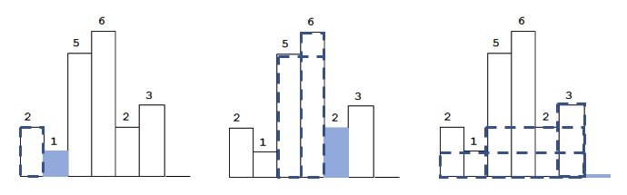

# 解法一

使用一个栈保存高度：

- 升序时，压入栈中
- 发生降序时，从栈顶弹出元素，计算，并且根据计算结果更新最大矩阵的值。重复这个过程直到栈中的高度重新保持升序

以题目中的示例，当遇到1，2，0(这个是添加到heights末尾的元素，为的是保证最后一次计算)时会进行计算，每次会计算的面积以图中的虚线表示：


- 104ms
- 89%

```python
class Solution:
    def largestRectangleArea(self, heights: List[int]) -> int:
        heights.append(0)
        stack = [-1]
        maxArea = 0
        for i in range(len(heights)):
            while heights[i]<heights[stack[-1]]:
                height = heights[stack.pop()]
                width = i - stack[-1] -1
                if width*height>maxArea: maxArea = width*height
            stack.append(i)
        return maxArea
```